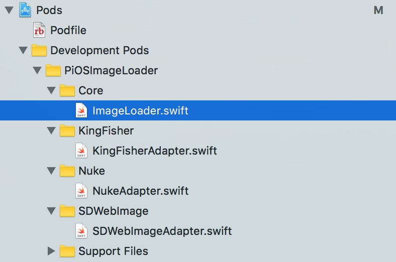

## RedPanda Pods

Along RedPanda we are providing a private set of Pods (see: [Cocoapods](https://cocoapods.org)) to kickstart the development of your iOS App.

#### RedPanda Cocoapods Specs Repo

The specs of these pods are located at [https://github.com/RedP4nda/RedPanda](https://github.com/RedP4nda/RedPanda) and will provide you some base features and adapters for a set of useful libraries.

Using RedPanda will provide you the access to this set of specs or you can use them by adding the following line to your Podfile:

```
source 'https://github.com/RedP4nda/Specs'
```

Then you can use any of the pods provided,
for example adding one of the following line to your Podfile:

```
pod 'RPImageLoader/KingFisher', '~> 0.9.1'
# or
pod 'RPImageLoader/Nuke', '~> 0.9.1'
# or
pod 'RPImageLoader/SDWebImage', '~> 0.9.1'
```

Will enable you to use an adapted set of libraries to add asynchronous image loading to your application, with a single maintained api using one of the provisioned libraries for this feature, eg: KingFisher, Nuke or SDWebImage.
See [https://github.com/RedP4nda/RPImageLoader](https://github.com/RedP4nda/RPImageLoader) for more details on this particular feature

#### RedPanda adapted library explained:

How it works ? The system is based on Cocoapods' specs/subspecs syntax

The pod will contain the required code to provide a single api to use the intended feature and each subspec will integrate the adapters to bind these api calls to the libraries.

Here is how it's done for the _RPImageLoader_ pod

_RPImageLoader.podspec_:

```
  s.default_subspec = 'Core'

  s.subspec 'Core' do |a|
    a.source_files = 'RPImageLoader/Classes/Core/**/*'
  end

  s.subspec 'KingFisher' do |a|
    a.source_files = 'RPImageLoader/Classes/KingFisher/**/*'
   a.dependency 'RPImageLoader/Core'
    a.dependency 'Kingfisher', '~> 3.5.0'
    a.xcconfig =  { 'OTHER_SWIFT_FLAGS' => '$(inherited) -DRPKingfisher' }
  end

  s.subspec 'Nuke' do |a|
    a.source_files = 'RPImageLoader/Classes/Nuke/**/*'
    a.dependency 'RPImageLoader/Core'
    a.dependency 'Nuke', '~> 5.1'
    a.xcconfig =  { 'OTHER_SWIFT_FLAGS' => '$(inherited) -DRPNuke' }
  end
```

The default subspec _Core_ will integrate the classes to provide the api for the pod, the other subspecs like _KingFisher_ contains the adapter for the KingFisher image loading library so when a developer adds ```pod 'RPImageLoader/KingFisher', '~> 0.9.1'``` in his project's Podfile the according subspec will be loaded and the library _KingFisher_ will be used.

Here is what the pod structure looks like:




#### Create a pod / add library support

To contribute by adding a new pod you only have to follow the cocoapods guide from [here](https://guides.cocoapods.org/making/making-a-cocoapod.html)

To provide new library implementations to an existing pod you have to add the code to support your library and update the podspec to add the subspec for the new support added.
