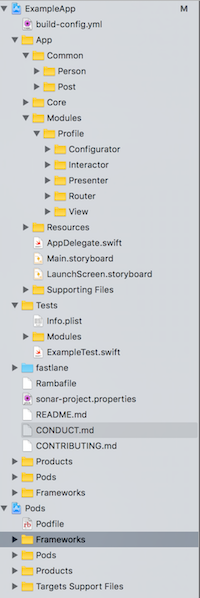

## RedPanda template

The template used to generate a new RedPanda project is located in the [Template folder](../Template).

It includes a skeleton project and various config files. This is what needs to be changed if you want to update what RedPanda will generate upon creating a new project.

### Architecture


#### Folder Structure

  The project folder structure is the following:

  


##### App
  Contains the code of the application
  ##### Common
  Contains common code used from differents modules of the application (ie. Models, Services, Managers, Helpers ...)

##### Modules
  Contains modules of the application, this is where [Generamba](#Generators) will generate VIPER modules

##### Core
  RedPanda features that will be moved later to a library

### Cocoapods
  Cocoapods is used to integrate 3rd party libraries and RedPanda provided libraries and implementation into the project, along with other utilities such as [Natrium](#Environments)

### Build Configs
  The project contains 3 build configurations that are intented to customize build settings et arguments depending on the build type selected for the application, configurations provided are:
    - Debug
    - AdHoc
    - Release

### Environments (Powered by Natrium)

  Environments can be a real pain to manage, RedPanda bundles [Natrium](https://github.com/MrCloud/Natrium/) into you project, check the _build-config.yml_ file.

  Environments provided:
    - Dev
    - Qualif
    - Preproduction
    - Production

#### Fastlane
      RedPanda provides some features as Fastlane lanes or Actions:

##### Versioning
      Upon creating your project RedPanda will also enforce some best practices, such as using the GitFlow workflow for versioning:

      Your project will be initialized with a _master_ and _develop_ branch created. And a proper _.gitignore_ file will be added and init commit performed

      Configure your remote and you're good to go:
      ```
      git remote add origin [REPO_URL]
      git push -u origin --all
      ```

##### Packaging
  RedPanda also generates lanes for your project in order to help you package and export your application, you are responsible for correctly providing signing configuration to the project:
  - _test_: runs the tests for the project
    ```
    fastlane test
    ```
  - _build_adhoc_: builds and export the AdHoc version of the app (the environment can be specified with the _environment:_ option)
    ```
    fastlane build_adhoc environment:Production
    ```
  - _testflight_beta_upload_: builds and upload your application on TestFlight
    ```
    fastlane testflight_beta_upload
    ```
  - _build_appstore_: builds and export the AppStore version of the application
    ```
    fastlane build_appstore
    ```

  Feel free to customize and update your _Fastfile_ especially if you update the build configs of your project.

##### Delivery (GitFlow + Packaging)
  RedPanda provides _Fastlane_ lanes to manage the release workflow according to [GitFlow](http://nvie.com/posts/a-successful-git-branching-model/). To deliver a version of your application run the following example lane sequence:
  ```
  fastlane init_release version:1.1
  fastlane testflight_beta_upload
  fastlane finish_release version:1.1
  ```

  1. This will create a new _release/1.1_ branch from _develop_, update the version number of the app to _1.1_, commit the changes and push this new branch to the _origin_ remote.
  2. Build and updload the app with the _Release_ build config and _Production_ environment and then upload it to TestFlight.
  3. Then it will finish the release process by merging back your _release/1.1_ branch into _develop_ & _master_, create the _1.1_ tag and push these to the _origin_ remote and then delete the _release/1.1_ branch both locally and remotely.

#### Generators
  RedPanda also bundles a generation tool into your project: [Generamba](https://github.com/rambler-digital-solutions/Generamba) in order to ease template-based generation.

  The project is provided with a VIPER template, that can be found in the Templates folder.

  To generate a new VIPER module run:
  ```
  generamba gen [MODULE_NAME] swifty_viper
  ```
